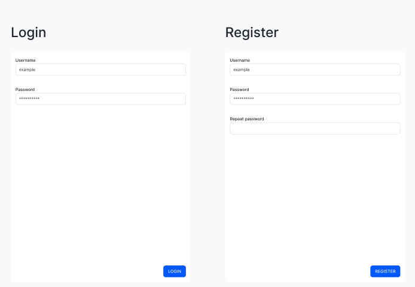
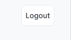
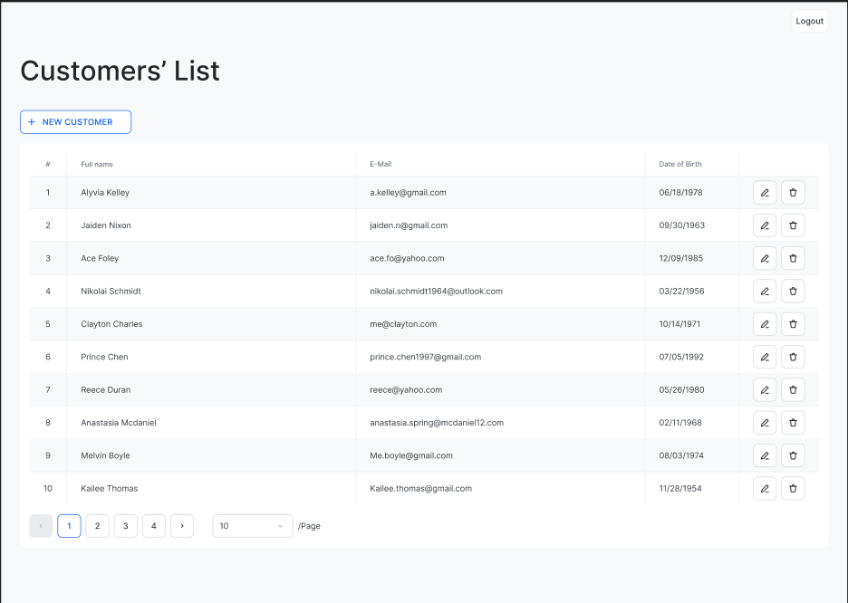
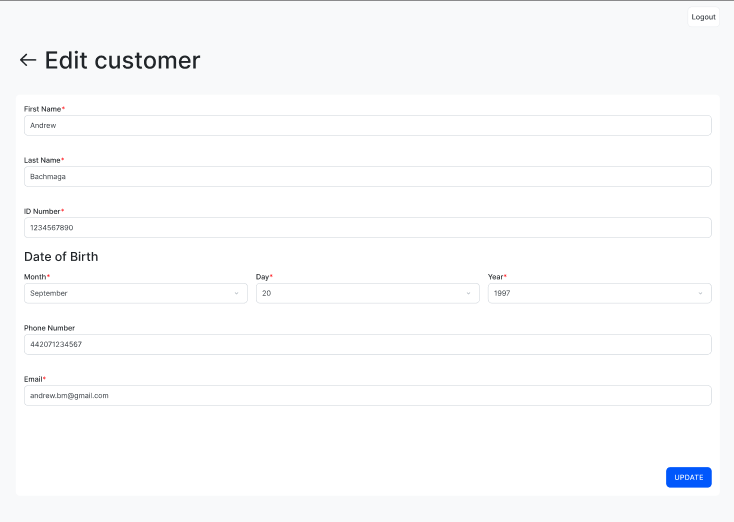

# Техническое задание фронтенда "Customers panel"
## 1. Описание проекта
Панель для управления клиентами с backend-частью.
## 2. Стек технологий
- HTML/JS
- [SCSS](https://sass-scss.ru/) (=Sass) (CSS-препроцессор)
- [notyf](https://carlosroso.com/notyf/) (всплывающие уведомления)
- [zod](https://zod.dev/) (валидации)
## 3. Требования
### Общее
Веб-сайт должен быть разработан согласно [дизайну](https://www.figma.com/design/SHQosRRYgD8OrkY0yEUBN0/%D0%92%D0%B5%D0%B1-%D1%81%D0%B0%D0%B9%D1%82-%22Customers-Panel%22?node-id=11-2&t=yKiZwJiPbD54jOpj-1) и хорошо выглядеть на десктопе.
Язык проекта - английский.
Стрелка "Назад" на страницах - возврат к предыдущей.

### 3.1 Обработка ошибок
Все ошибки приложения должны быть читаемы и выведены через `notyf`.
Ошибки могут быть:
1. Клиентские. К ним относятся валидация полей и прочая логика на фронтенде.
2. Серверные. К ним относятся ошибки запросов. Каждая серверная ошибка содержит тип ошибки, для которого нужно выводить какое-то сообщение. Может быть несколько сценариев:
	1. Если тип ошибки `UNKNOWN` - выводить "Unknown error".
	2. Если тип ошибки `VALIDATION` - выводить "Bad input".
	3. Если тип ошибки любой другой - выводить сообщение, подходящее под тип ошибки. Например, если ошибка имеет тип `WRONG_CREDENTIALS`, можно вывести сообщение "Wrong login or password". Сообщения ошибок остаются на усмотрение фронтенд-разработчику. Все ошибки этого типа задокументированы в API бэкенда.

### 3.2 Пользователь
- Пользователь может пользоваться панелью только при наличии аккаунта.
	- Вся авторизация работает с помощью JWT токенов. Предусмотрены только access-токены. Токены хранятся в httpOnly cookies.
	- Для проверки авторизирован ли пользователь, необходимо отправлять запрос на получение профиля.
	- Если пользователь открывает страницу, к которой у него нет доступа - его редиректит на страницу авторизации/регистрации.
- Для каждого пользователя создается собственная панель клиентов.

- Страница для авторизации/регистрации должна быть доступна по ссылке `/login`.
- При логине и регистрации аккаунта должны отправляться соответствующие запросы.
- Валидация полей (при регистрации)
	- Поле `username` должно быть непустым, 4-32 символа, содержать только латинские буквы и цифры.
	- Поле `password` должно быть непустым, 8-64 символа, содержать только латинские буквы, цифры и символы `@`,`$`,`%`,`&`,`_`.
	- Поле `repeat password` должно быть идентично значению поля `password`.

- На страницах есть кнопка logout - при нажатии отправляется запрос на разлогин, и пользователя перемещает на страницу авторизации/регистрации.

### 3.3 Список клиентов

- Страница доступна только для авторизированных пользователей.
- Страница должна быть доступна по адресу `/`.
- На странице должен выводится список клиентов с использованием пагинации.
	- Возможные варианты максимального показа клиентов на одной странице - 5, 10, 20.
- Клиент может быть удален. В случае успеха необходимо вывести сообщение об удалении и обновить список клиентов.
	- Также необходимо учесть потенциальное изменение кол-ва страниц в пагинации после удаления.
- Клиент может быть изменен. Должен происходить редирект на страницу изменения. Подробнее про изменение клиента в следующих разделах.
- Новый клиент может быть создан. Должен происходить редирект на страницу создания. Подробнее про создание клиента в следующих разделах.

### 3.4 Создание клиента

- Страница доступна только для авторизированных пользователей.
- Страница должна быть доступна по адресу `/customer/new`.
- При нажатии на кнопку Create - отправляется запрос на создание клиента. Если клиент успешно создан - вывести соответствующее уведомление и редиректнуть на список клиентов с задержкой в 2 секунды.
- Поля:
	- Поле `first name` должно быть непустым, 2-128 символов, содержать только латинские буквы и `-`.
	- Поле `last name` аналогично `first name`.
	- Поле `id number` должно быть непустым, ровно 10 символов, содержать только числа (само поле является строкой).
	- Поле `month` должно быть не пустым, иметь варианты выбора всех месяцев в их порядке начиная с января. По умолчанию пустое.
	- Поле `day` должно быть не пустым, иметь варианты выбора всех дней выбранного месяца и года в порядке возрастания. По умолчанию пустое. Если поле `month` или `year` изменились и `day` более не входит в диапазон дней - установить пустое значение. Если поле `month` или `year` пустое - должно иметь значения с 1 по 31.
	- Поле `year` должно быть не пустым, иметь варианты выбора с 1900 по текущий год в порядке убывания. По умолчанию пустое.
	- Поле `phone number` может быть пустым. Если не пустое - должно иметь 10-16 символов, содержать только числа (само поле является строкой).
	- Поле `email` должно быть непустым, подходить под формат электронной почты.

### 3.5 Изменение клиента

- Страница доступна только для авторизированных пользователей.
- Страница должна быть доступна по адресу `/customer?id=`.
	- Если айди не передан или клиент не найден - редирект на главную страницу.
- При нажатии на кнопку Update - отправляется запрос на обновление клиента. Если клиент успешно обновлен - вывести соответствующее уведомление и редиректнуть на список клиентов с задержкой в 2 секунды.
- Для полей действуют аналогичные правила, что и для создания.